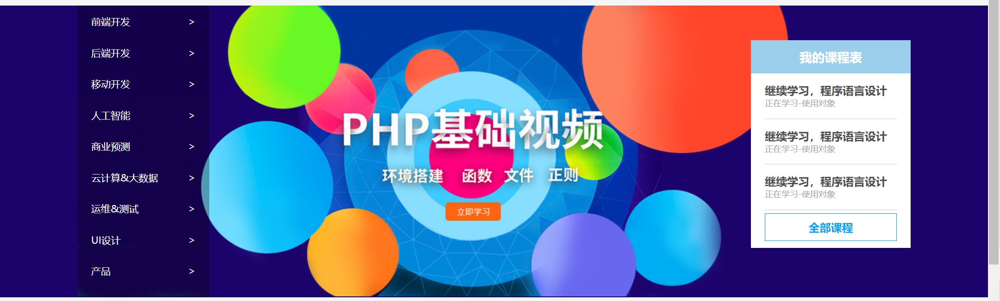
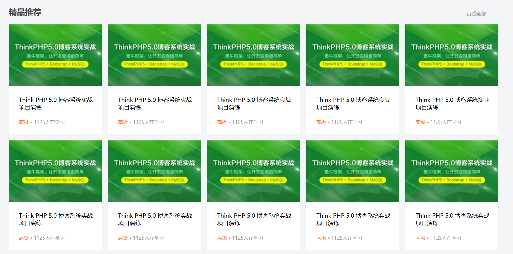
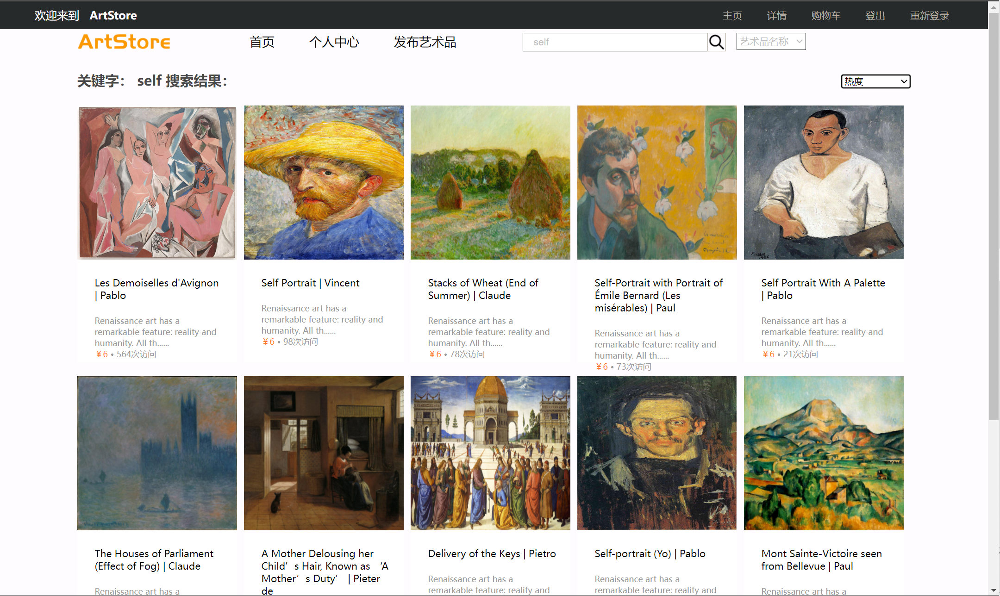
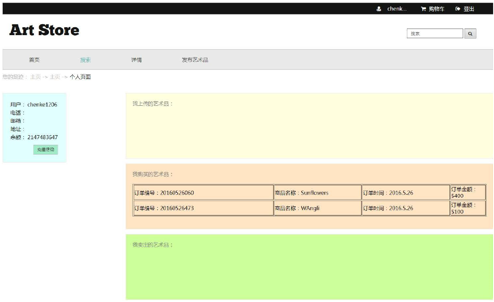
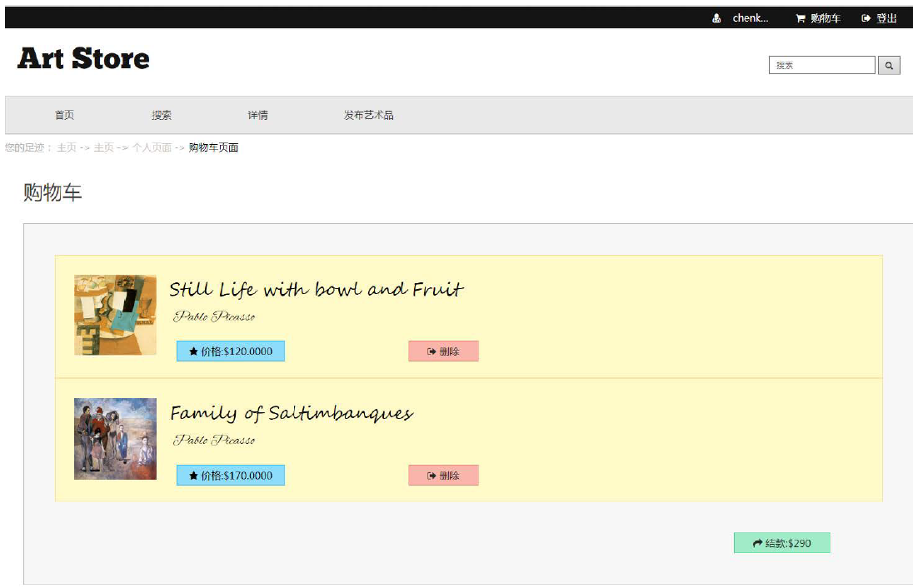

# project分析与设计

## 一、页面分析

网站需要以下几个界面：

主页（进行艺术品展示，同时可以通过搜索查找商品）、登录、注册、搜索得到商品界面、艺术品详情页、个人中心、购物车界面、艺术品发布界面；逐个设计如下：

### 1、主页

主页的界面设计参考mi官方网站：

- 最顶部为简洁的导航栏，左侧为logo和**一段简要描述**，右侧操作栏登录前只包括主页、登录、注册的操作与购物车，登录后将登录|注册改为用户信息的下拉框；

- 顶部以下是主页的操作导航，包括：**首页、发布艺术品与个人中心**三项操作，三项后跟着的是搜索框进行搜索操作实现；布局见

    

- 操作导航下为轮播图，效果参考（把左侧的链接导航更改为box也可以删除)，右侧课程表删除，img从背景图片改为div插入进行轮播
- 轮播图下为热门艺术品展示，效果如下：左侧精品推荐改为热门艺术品，右侧查看全部操作删掉；每个小格子里展示的是艺术品照片 + 名称 + 作者姓名 + 售价 + 访问量：即把照片改为艺术品照片，黑体字改为艺术品名称 + 作者；再下一行的高级展示成售价，右侧多少人在学习改为访问量xxx；需要增加样式：鼠标划过时增加动态效果；
- 热门艺术品下为最新发布，效果同上，在价格和访问量下添加一行为发布时间；
- 热门艺术品下面为footer，包括版权信息和一些基本介绍；

### 2、登录与注册

登录与注册界面相同，维持最顶部的基础导航栏，下面插入一张背景图片，然后用一个表单进行登录或注册的信息填写；

### 3、搜索得到的商品界面

- 最顶部的基本信息导航和头部的基本操作导航保持原状；
- 导航下面一行为：关键词：xxx + 搜索结果：效果如下：
- 下面分页展示搜索结果，每页的商品维持在两行，每行4个总计8个；艺术品展示的结果显示同上面热门艺术品，不需要发布时间；但同样需要划过时的特效，点击可以跳转到艺术品详情页
- 搜索结果下为分页的页码，需要实现一个分页器，通过ajax进行分页，可以点击某一页跳转到该页或者通过文本框输入页码跳转到指定页码
- 最下面维持版权信息等footer

### 4、艺术品详情页

顶部信息保持不变，下面为一个div，div内左侧为img，即艺术品图片，右侧为一个表格，在表格中展示艺术品信息；

- 包含 艺术品图片、名称、作者姓名、价格、访问量、是否已售出、发布日期、发布者用户名、详细参数（指年份、大小（长度与宽度）、时代、风格等至少4项） 等至少10或12 项信息。若有余力，除此之外也可展示其他可能用到且可展示的信息。
- 对于 为空值的数据项，需显示一定的替代信息，比如 “该作品没有发布者” “该作品没有简介内容”，而不应直接显示 null 或者将该项留空。

### 5、个人中心

效果如图

需要展示以下内容

- **个人信息**：展示注册时所用的信息（用户名、邮箱、电话、地址）以及 账户余额 。个人信息不要求可维护，即无需添加修改各项信息（与密码）的功能。
- **充值功能**：用户可以对账户余额进行充值。 不用真的充钱。 详细需求如下：新注册的用户的初始余额为 0。在个人中心页面上点击 “充值余额” 按钮弹出一个 充值窗口 ，其中含有一定的文字说明、一个文本框与 “充值” 按钮。输入文本框填写充值金额，只允许正整数金额，对于不合法输入需有错误提示。点击 “充值” 后再弹出一个确认框，确认后对数据库信息进行更新，充值金额直接到账。
- **我的订单列表**：展示已成功下单（即已购买）的艺术品。详细需求如下：至少显示 订单编号、订单时间、艺术品名称、订单金额 信息（即结账下单时生成的订单信息）。点击艺术品名称可跳转至相应的详情页。
-  “我发布的艺术品”、“我卖出的艺术品”，详见 Part B；

### 6、购物车界面

效果如图：

需要展示一个个购物车商品，（不要求实现分页），需显示 艺术品缩略图、名称、作者姓名、价格、简介。

- 信息展示：**若艺术品被 抢先购买** ，即在用户A将该艺术品加入购物车后，用户B也将该艺术品加入购物车并直接结款，则需要在该艺术品旁显示 “**该艺术品已售出**”，并 提示用户从购物车中删除该艺术品（根据**艺术品的state状态判断是否已售出**，若已售出则提醒删除该艺术品） 。若艺术品的任何信息被更改，则需要在该艺术品旁显示 “该艺术品信息存在变动”。（每一个商品用一个状态码记录当前的状态，用户加入购物车时记录id号和状态号，后续如果艺术品信息被修改，会修改最新的状态码，但用户的购物车中保持旧的状态码，根据**状态码是否相同判断该商品是否在添加购物车后被修改过**）
- 结账/下单操作：在结账按钮上显示 总价 ，点击后 弹出确认框 ，**确认框中需显示 总价、账户余额、地址信息、电话**
    **信息 并具有确认、取消按钮**。点击确认后 若**账户余额充足** ，则将购物车中艺术品的**状态设置为“已售出”**，为 每件购买的艺术品
    生成一个 订单 （即记录艺术品名称、订单金额（即该艺术品售价）并生成订单编号与订单时间）， 清空购物车 ，并 扣款 。
    点击确认后 若**账户余额不足** ，则需显示相应提示，购买失败。点击确认后 若**结款的商品列表中存在已售出的艺术品** ，则需显示相应提示，购买失败。卖出艺术品时，**在减少购买者余额的同时， 若存在出售者，则出售者账户余额需增加相同数额。**
- 删除操作：删除按钮，从购物车中删除该艺术品。

### 7、发布/修改已发布艺术品

同一个界面进行发布与修改

