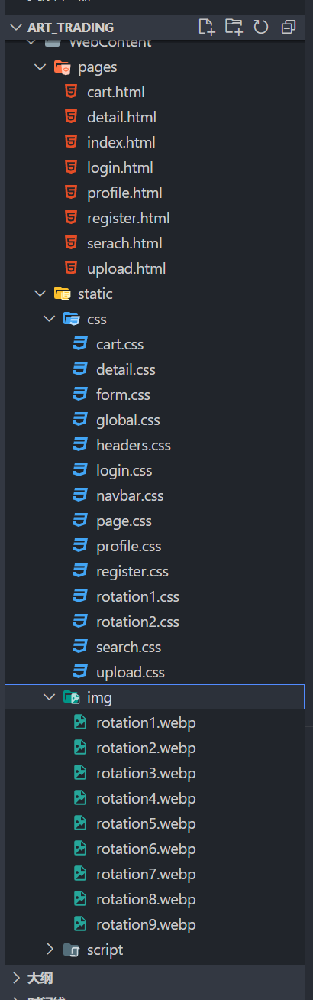
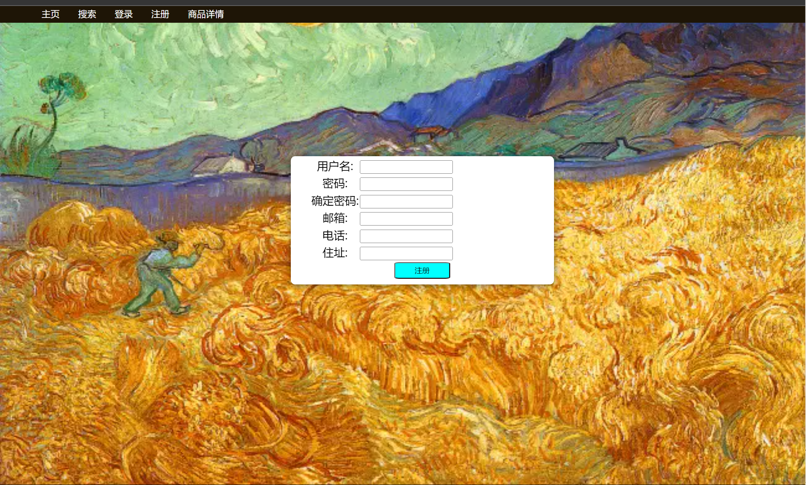
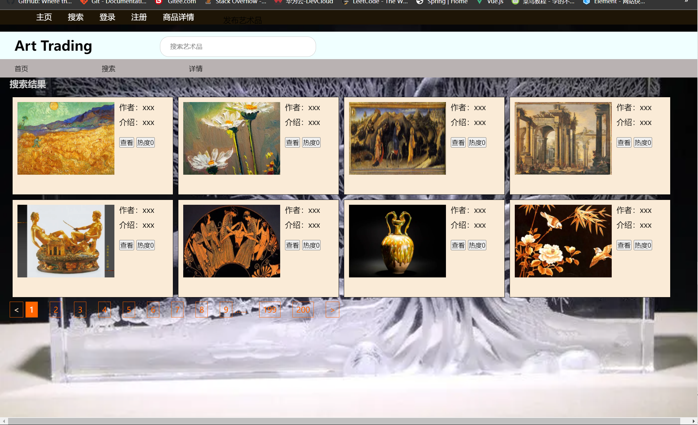
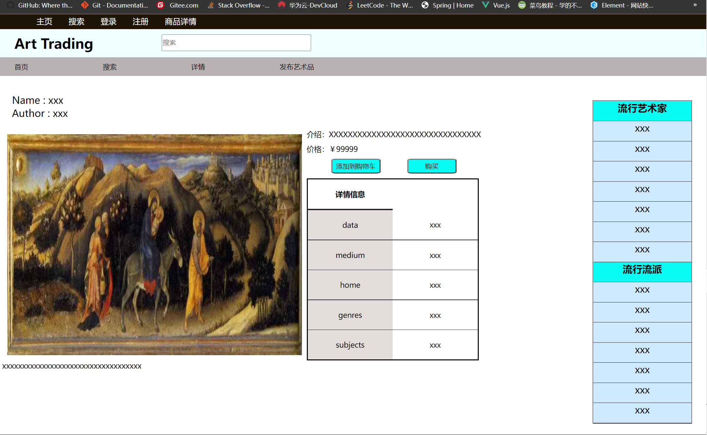
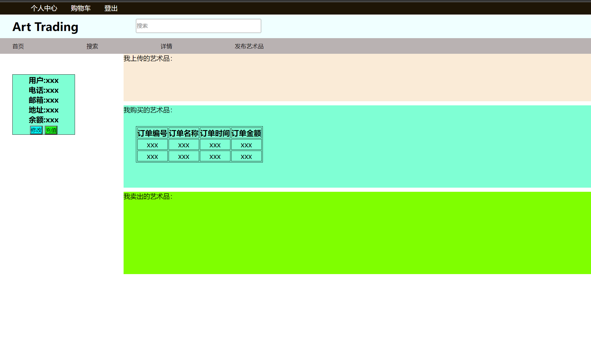
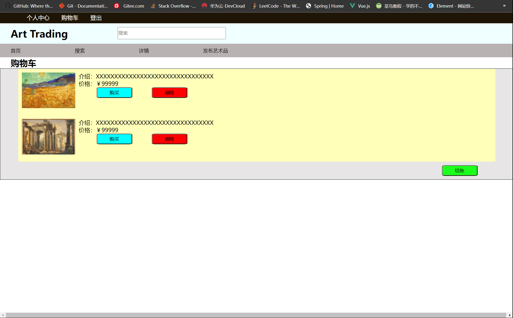
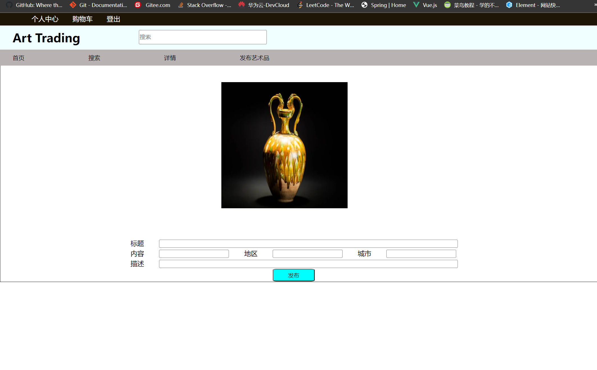

# 艺术品交易网站中期报告

20302010043 苏佳迪

当前的网站项目结构如下：

前端界面如下，用原生html与css实现：

主页，轮播图展示一些艺术品：

<video src = "video/index.mp4" style = "zoom : 20%">

登录页面：

注册页面：

搜索页面：

商品详情页面：

个人主页：

购物车页面：

上传艺术品界面：

