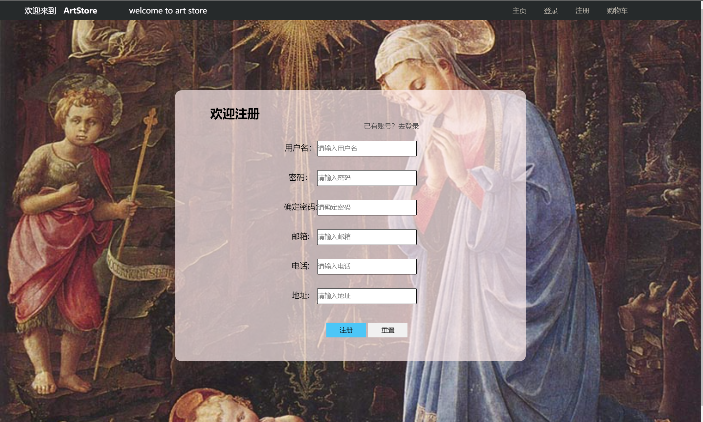
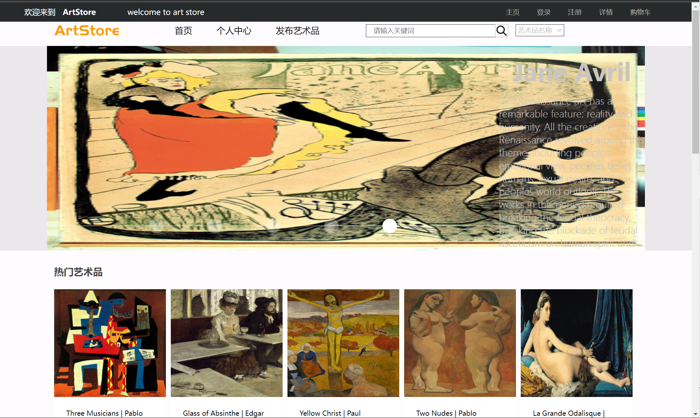
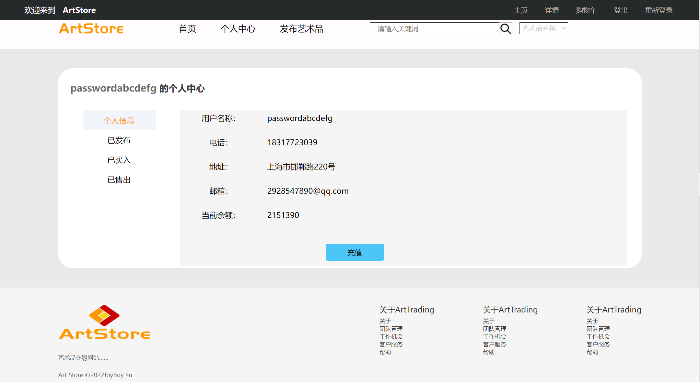
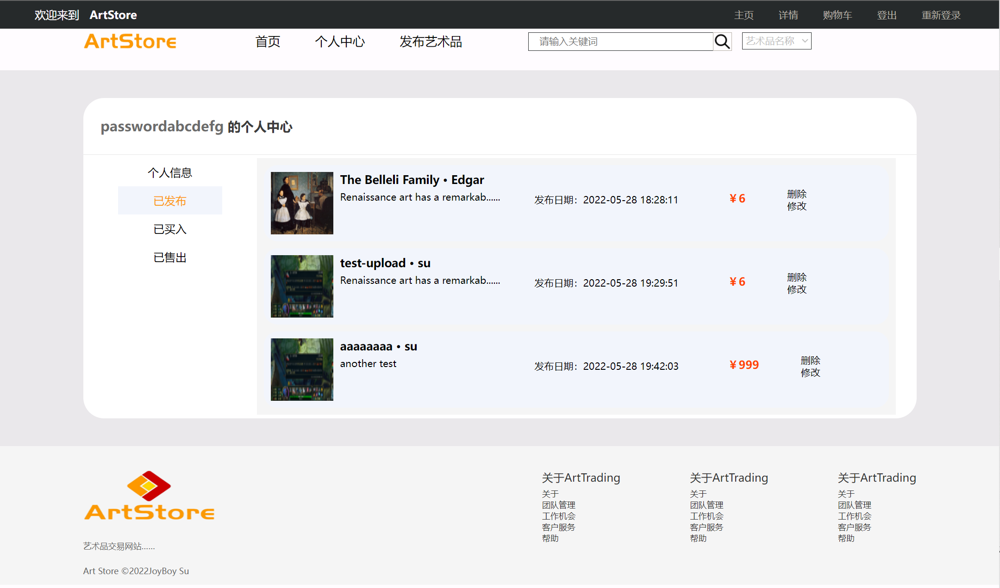
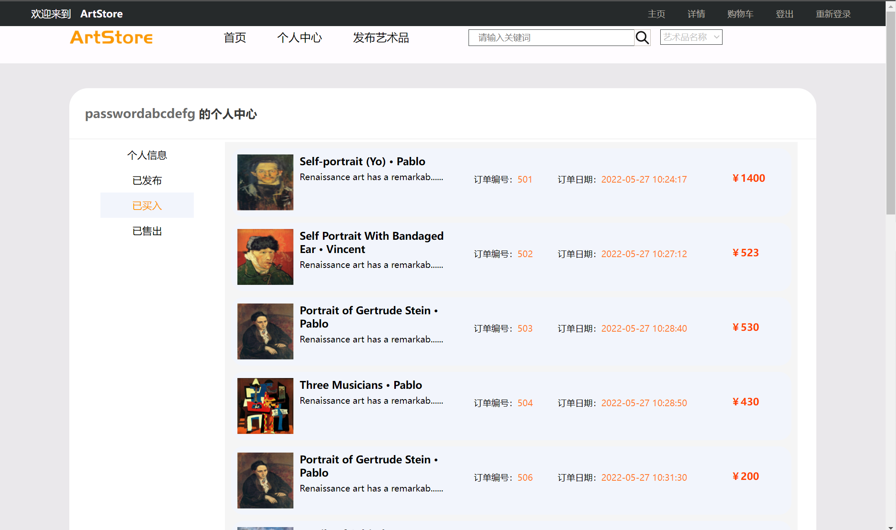
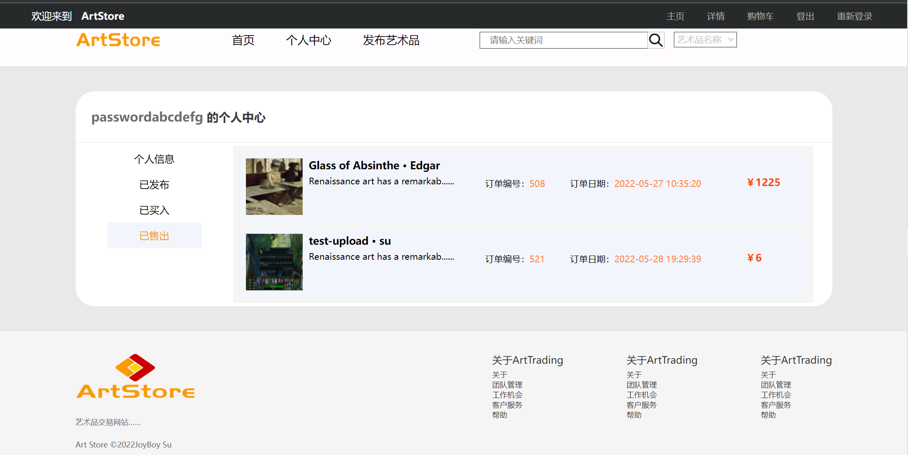
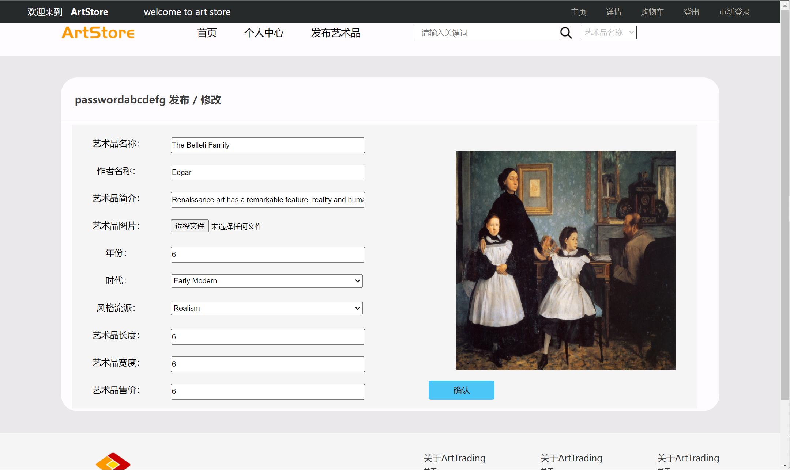
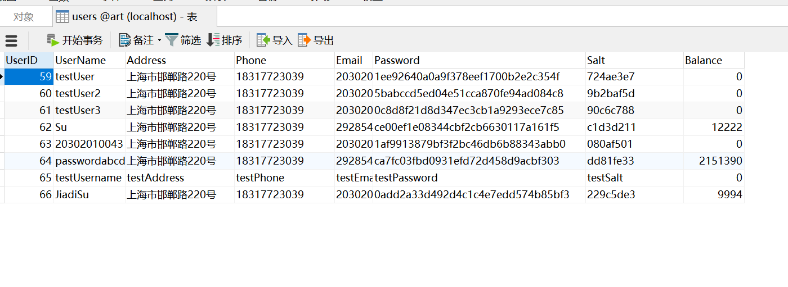

# 艺术品交易网站说明文档

20302010043 苏佳迪

## 一、各页面截图

### 1、登录与注册

### 2、主页

### 3、艺术品详情

### 4、搜索

### 5、购物车

### 6、个人中心

#### 6.1 个人信息

#### 6.2 已发布的艺术品

#### 6.3 已买入的艺术品

#### 6.4 已卖出的艺术品

### 7、发布修改

## 二、附加部分完成情况

1、实现密码哈希加盐存储，由时间戳生成盐，与密码结合后进行加密。

2、实现密码强弱UI提示

3、实现对艺术品模糊搜索

通过求关键词与艺术品名称的**Levenshtein距离**，计算匹配度进行模糊搜索；（虽然但是，匹配度还需要优化，模糊搜索效果不是很好）

4、部署到服务器

公网ip地址为`47.110.152.188`