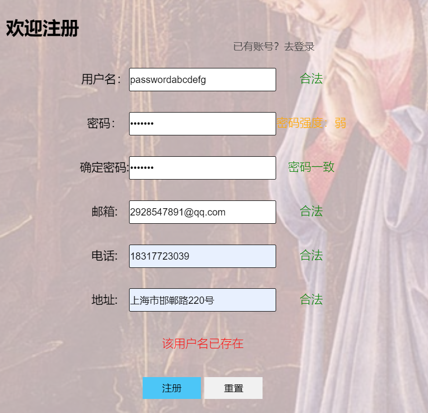
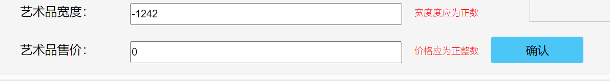

# 项目说明文档

20302010043 苏佳迪

ps：用`PlantUml`画的图，可能在文档里不太清楚，附上了原图

## 一、用例图


## 二、类图


## 三、状态机图


## 四、流程图


## 五、主要功能实现思路

按页面的顺序简要介绍各页面的一些功能是如何实现的

### 0、各个界面的通用功能

#### 0.1 获取导航栏

获取导航栏的逻辑为：在每次请求页面前，后端会进行token校验，若token不存在或token无效则返回登录前的导航栏；反之则返回登录后的导航栏。

#### 0.2 界面拦截

在一些具备权限检查的界面进入前（或操作前），后端会进行token校验，若token不存在或token无效则将请求终止，并返回`error + message`，前端通过js跳转到login界面进行登录，登录后跳转到刚才的界面；

且即使进入该页面后，每次操作仍然会进行token检查，如果token过期则提醒重新登录并跳转到登录界面

### 1、登录/注册界面

登录的逻辑为：用户输入用户名与密码（或邮箱与密码），**在前端用js进行检查**（`oninput`事件触发检查），若检查结果不通过，则在input后的span中提示用户名（或密码不合法，为空）；前端检查**通过后提交表单，后端查询数据库**，判断用户是否存在与密码是否正确，（判断经计算后的哈希值与数据库的哈希字段是否一致），如果不一致，则登录失败；如果登录成功，需要根据用户的信息生成一个token，token是自解释的无需存到数据库，将该token返回给客户端，客户端作为`cookie`存起来，以后每次发请求都会带着token，登录成功后前端存起来token，并**跳转到上次的页面**；（用户在进入login界面前，会执行函数`beforeEnterLogin()`，该函数会将从跳转到login前的路径记录起来，在登陆后回跳转到该页面）

（2）注册，注册的逻辑为：用户在前端输入用户名密码，电话邮箱，同时填写地址，前端需要检查信息的合法性，如限制密码的规范，通过校验后提交表单给后端，后端**先判断信息是否合法，能够注册**（用户名与邮箱冲突的情况），通过校验后添加到数据库中，包括用户名`UserName`，哈希加盐后的密码`Password`，电话`Phone`与邮箱`Email`，以及地址信息`Address`字段，自动生成`UserID`；

用户权限通过登录后返回的token来进行管理，具体思路入下：

```php
/**
 * 用户权限类，用来生成token，存储token和确认token
 * 用户发起请求后，有两种请求：1、登录请求 2、其他请求
 * 1、登录请求：登录请求时查表，判断表中是否有token信息
 *    如果有旧的token，不管是否过期，都update成新的token和新的过期时间
 *    如果没有旧的token，就设置token及有效期
 *    调用setToken()方法设置新的token与有效期
 * 2、其他请求：其他请求时，先查token是否有效，
 *    如果传过来的token有效，则执行操作，并更新token的有效时间；
 *    更新token有效时间时，无需判断是否存在，直接update有效时间即可；
 *    如果token无效（不管是过期还是不存在），就返回失败重新登录
 *    调用checkToken()方法检查token是否有效，
 *    调用updateToken()方法为token设置新的有效时间
 */
```

### 2、主页界面

主页的逻辑从上到下：

（1）热门艺术品`hot`展示（最新艺术品`new`展示）：在进入主页后，需要发请求获取当前最热门的十个艺术品展示在页面中；

逻辑实现：当进入`index`主页时，通过Ajax发请求得到当前最火的10个艺术品进行展示，注：此次请求无需鉴定权限，后端返回生成好的html页面。

（2）轮播图展示：进入主页后，需要发请求由后台随机生成五个艺术品并生成轮播图的html页面返回，前端得到响应后处理到页面中，通过css产生轮播图效果；

同时，在将html插入页面后，需要将轮播图与热门最新艺术品的展示盒子绑定上单击事件，点击盒子可以跳转到detail界面，并传递id。

### 3、艺术品详情界面

艺术品详情的逻辑与实现入下：

判断是否存在艺术品id（即是否是直接进入的详情界面而没有选择艺术品）

若存在id，则向服务器发请求，**根据`ArtID`获得该艺术品的详细信息展示到表格中**；同时该页面在搜索到艺术品详细信息后需要提供**添加到购物车**与**购买**的操作按钮（同样由后端返回按钮页面）；若不存在id，则**由服务器随机生成一个有效的`ArtID`然后展示其详细信息**，与上述相同。随后，执行`increaseVisit($artID)`函数，将该艺术品的访问量增加。

**添加到购物车**的逻辑：前端通过js为添加到购物车的按钮绑定单击事件，点击后触发事件`addToCart`，将请求发给服务器，参数包括艺术品的id（当前页面`url`），同时cookie中存储token把用户的信息带到服务器，服务器验证token信息得到`userid`，如果用户未登录则返回false，设置message为`login`，js得到响应让其去登陆；如果用户已登陆，则查询数据库判断是否已存在该艺术品/该艺术品已被售出，若存在某种情况则设置message并返回false；反之将`userid`与`artid`的匹配关系存入carts数据表；

购物车的逻辑绑定用户和艺术品，**二者之间是多对多的，需要用carts一个表来存储**。

### 4、搜索

判断是否存在keyword，如果存在，则查找所有艺术品，按照keyword对所有艺术品进行过滤（编辑距离求相似度，按相似度排序），返回前端传入的页码数据（刚进入页面是默认为1）；

如果不存在keyword则不进入search界面（在search界面后若将keyword调整为空，则分页显示所有艺术品）；艺术品的简介可能很长，在后端将该简介截断，只展示前30个字符，后面用...代替，将修改后的内容设置到html页面中。

关于分页：在**进入页面时**默认页码为1（如果后端返回符合条件为0个，则修改为0），总页码更新为返回的total计算得到的页码，总个数更新为返回的total；在**修改页码时**，发起请求重新获取艺术品列表，先删除之前的艺术品，再添加新的艺术品，分页信息无需改变（页码除外）；在**修改关键字时**，更新`url`参数，先重置当前页码，发请求获取新的艺术品信息，拿到数据后**设置`total`和`totalPage`**（如果total为0则把页码设置为0），删除原艺术品界面，添加新的艺术品界面；在**修改排序方式时**，重置当前页码，其余参数不更新，只发请求获取新的排序结果并展示。

可以**考虑在后端用缓存的机制暂存过滤出来的数据**，避免每次访问数据库，缓解数据库压力，每次搜索先看和缓存中的关键字是否一致，不一致则更新缓存。

关于搜索参数：在进入页面前，将其他界面的搜索参数设置到`sessionStorage`中，进入搜索界面后从`sessionStorage`中读取搜索参数然后再发起请求查找艺术品，从而保证不会在其他界面设置好的搜索参数在进入search后丢失。

### 5、购物车

购物车的逻辑如下：**进入购物车前发请求校验登录状态**，若未登录则打回登录界面。

确定登录后获取`nav`，然后获取用户信息，根据用户信息，**查询`cart`表**得到用户的购物车信息，包括每个艺术品的信息，总数等；根据这些信息分别生成购物车顶部页面与内部页面，同时查询每个艺术品的状态（state和version），以便得到tips。

以上为界面展示的逻辑，支付的逻辑如下，js处理用户的选择，并进行初次检查判断是否存在不能购买的商品；通过处理后把请求法到后端由`php`处理：再次判断是否存在不可购买的商品，如果存在则全部不支付；如果都可支付，则判断余额是否充足，充足的话则扣除余额，把此次支付的商品从购物车中删除，修改这些商品的状态，同时为每件商品生成一个订单，**订单的信息包括订单号，支付方id，发布方id，艺术品id，支付时间**；

购物车前端交互逻辑：

（1）查看商品详情/删除：点击每一项艺术品的查看详情应该要跳转到响应的查看详情位置，需要在`delete`和`detail`的点击div绑定一个点击事件，同时未div设置`cartID`或`artID`（删除为`cartID`，详情为`artID`），点击事件中，根据属性做出相应的响应。

（2）结算价格：通过`jQuery`操作复选框，复选框的改变时会通知结算栏进行数据更新。（不可取，change事件不触发）；

### 6、发布/修改艺术品

发布修改的逻辑如下：进入该页面前发请求校验登录状态，如果没有登录则跳转登录；若登录了，但是url参数对应的艺术品发布者不是当前用户，会提醒没有权限、重新登陆并跳转到登陆界面。

表单项包括：艺术品名称，作者姓名，作品简介，年份与年代，流派，长宽，图片与价格；校验条件如下：

- 艺术品名称、作者姓名、作者简介的校验为不为空（作者姓名不限制在已有的artist中）
- 年份的校验为必须为整数，暂定范围为-2000 ~ 2000四千年；
- 长宽的校验为正数，价格的校验为正整数；
- 年代、流派的信息必须从已有的年代和流派中选择（发请求获取list，设置`其他`选项）；
- 图片的校验为非空；

js在前端进行表单内容的校验：通过正则、`isNaN()`等方式，校验通过后通过js将表单信息发给php，php首先获取用户信息与发布时间，随后通过`_FILES`提供的操作保存上传的图片，然后将表单项信息更新到数据库中；修改时增加一个步骤即判断是否有修改，若无修改则直接结束，反之则执行与添加时相同的操作流程。

### 7、个人中心

个人中心的逻辑如下：**前端在进入profile之前发请求校验登录状态**，如果没有登录则打回去重新登录；

个人中心是一个整体的左右结构，左侧是用户信息，以及一些选项（我发布的、**我买入的**以及**我卖出的**），这里的操作选项为`div`套`ul`实现，`div`中存储当前选中的`index`，在点击其他选项时，会通过ajax重新发请求更新界面。

个人信息获取：根据`token`得到id，随后根据id查用户信息并返回界面；

发布艺术品获取：根据`token`得到id，随后根据`UserID`去`art`表中查询对应`AccessionUserID`字段与之匹配的艺术品并生成列表返回；

买入和售出的获取：二者公用一套逻辑，根据`UserID`去查`order`表，前者查询`BuyUserID`与之匹配的，后者查询`ReceiveUserID`与之匹配的，查询到`ArtID`后结合`art`表得到艺术品的信息，结合订单信息返回界面；

多表查询语句如下：

```sql
select OrderID, orders.Date, orders.Price,
arts.ArtID, arts.Title, arts.ImageFileName, arts.Author, arts.Description
from orders join arts on orders.ArtID = arts.ArtID
where orders.PayUserID = ?
```

删除已发布的艺术品：将每一个发布信息的`div`中都存一下该艺术品的id，需要删除时发请求把`ArtID`传向后端，后端首先判断是否已售出，若未售出则操作数据库进行删除。

**动态界面整体思路**：前端通过HTML写好固定的一部分界面，后端通过php动态生成用户访问时的界面，并由js操纵`dom`元素（或用`jQuery`）动态改变原html界面，以此达到生成动态界面的效果。

## 六、页面截图

### 1、登录与注册


### 2、主页


### 3、艺术品详情


### 4、搜索


### 5、购物车


### 6、个人中心

#### 6.1 个人信息


#### 6.2 已发布的艺术品


#### 6.3 已买入的艺术品


#### 6.4 已卖出的艺术品


### 7、发布修改


## 七、测试

按界面逐个测试情况：

### 1、登录

1.1 信息为空


1.2 用户不存在


1.3 密码错误


### 2、注册

2.1 信息为空


2.2 信息（用户名/电话/邮箱）不合法


2.3 密码不合法

长度不合法：


全部是数字：


2.4 确认密码与密码不一致

密码为空：


两次输入不椅子


2.5 用户名已存在



2.6 邮箱已存在


### 3、主页

3.1 token存在但无效，不会因为token为空报错


3.2 token不存在时，显示正确导航栏


3.3 登录导航栏


3.3 热门排序


3.4 最新排序


### 4、艺术品详情

4.1 无部分信息


4.2 未登录添加购物车


4.3 添加已售出的艺术品


4.4 添加已加入购物车的艺术品


### 5、搜索

5.1 在其他界面无关键字搜索，不跳转到search

5.2 在search界面无关键字搜索，查询所有艺术品


5.3 页码输入非法字符，无效，页码不跳转

输入小数：


输入其他字符：


5.4 点击页码不会超过最大值


5.5 输入页码超过最大值后，不会显示任何结果


### 6、购物车

6.1 未登录无法购物车，会直接跳转到登录

6.2 结算已售出艺术品


6.3 余额不足


### 7、个人中心

7.1 未登录无法进入个人中心，会直接跳转到登录

7.2 充值小数


7.3 充值字符


### 8、发布/修改

8.1 信息为空


8.2 年份为小数


8.3 长度/宽度为负数


8.4 长度/宽度为0


8.5 价格为负数


8.6 价格为0



8.7 价格为小数


## 八、附加部分实现

1、实现密码哈希加盐存储，由时间戳生成盐，与密码结合后进行加密。


**为什么需要哈希加盐存储？**

（1）首先，密码是不能明文存储在数据库中的，避免数据库被入侵后密码直接泄露，因此在数据库中存储的密码需要进行加密。

（2）其次，哈希加密是一种典型的单项函数，可以简单地由明文计算出密文，但很难从密文倒推出明文，因此通过哈希加密后的密文存储在数据库中为密码增强了安全性。

（3）最后，为什么要加盐？虽然哈希加密可以将明文加密成难以破译的密文，但同一个密码得到的密文总是相同的，而且确实存在很大一部分用户会用一些很简单很常见的密码（比如abcdefg），随着计算机的计算能力越来越强，这样就很容易被通过彩虹表攻击，哈希加密的安全性就大大降低。为了解决这种情况就需要将密码加盐，通过在密码后添加随机生成的盐（即字符串），那么即使是很常见的密码（比如abcdefg）也变得很不常见，即使是同一个密码其得到的哈希值是不同的，从而提高了安全性。

**实现**：该项目中选择对时间戳进行`md5`加密后得到的字符串取8位作为盐，将密码加盐后的字符串进行`SHA-256`加密后得到的密文和盐一同存入数据库，在登陆时读取存储的盐与用户输入密码进行拼接，在进行同样的加密算法得到密文与存储的password进行对比，一致则通过。

2、实现密码强弱UI提示


项目中的密码强度根据密码中的字符种类得到，源码如下：

```javascript
/**
 * 通过合法校验，判断强度，强度标准：
 * 1、只包含数字、大小写字母与特殊字符中一种
 * 2、包含数字、大小写字母与特殊字符中的两种
 * 3、包含数字、大小写字母与特殊字符
 */
    // 弱类型密码正则
let alphabetReg = /^[a-zA-Z]+$/;    // 纯字母正则
let charReg = /^[!@#%^&_]+$/;       // 纯特殊字符正则
// 强类型密码正则
let _numReg = /\d+/;
let _alphabetReg = /[a-zA-Z]+/;
let _charReg = /[!@#%^&_]+/;
validResult.pass = true;
// 弱类型密码
if(alphabetReg.test(password) || charReg.test(password))
    validResult.strength = PASSWORD_WEAK;
// 强类型密码
else if(_alphabetReg.test(password) && _numReg.test(password) && _charReg.test(password))
    validResult.strength = PASSWORD_STRONG;
// 中类型密码
else validResult.strength = PASSWORD_MEDIUM;
```

通过正则表达式判断密码中的字符类型，从而得到密码强度。

3、实现对艺术品模糊搜索

通过求关键词与艺术品名称的**`Levenshtein距离`**，计算匹配度进行模糊搜索；（虽然但是，匹配度还需要优化，模糊搜索效果不是很好）


具体比较思路如下：

```php
/**
 * 比较思路：求得两个字符串的编辑距离，根据编辑距离得到相关性与精度比较
 * 由于编辑距离会存在两个字符串之间长度差的误差，所以不能之间通过sim的计算方法得到相关性
 * 实际需要得到的是pattern与primary的子串间的相关性，
 * 而编辑距离存在一个界限，下界为两字符串的长度差，
 * 因此可以考虑进行长度差修正，得到一个表征该相关性的量为：
 * 1 - (distance - | primary.length - pattern.length |) / min(pattern.length, primary.length)
 * 即除去二者长度差部分的编辑距离，仅考虑较短字符串长度部分的相关性，
 * 将该相关性与精度比较，如果 sim >= primary，即匹配成功；反之匹配失败
 */
```

4、部署到服务器

公网ip地址为`47.110.152.188`

## 九、数据库修改

对数据库进行了以下简单修改：

arts表中添加版本号字段`VersionNumber`，默认为0（即添加艺术品时设置为0）。当发布者需要修改艺术品时，随着艺术品信息的更新会同步将版本号加1，表示艺术品发布以来信息的不同版本。carts中不仅存储`userID`与`artID`，还同时存储加入购物车时的艺术品版本号，版本号更改后通过对比版本号可以发现信息有修改，从而提醒更新。